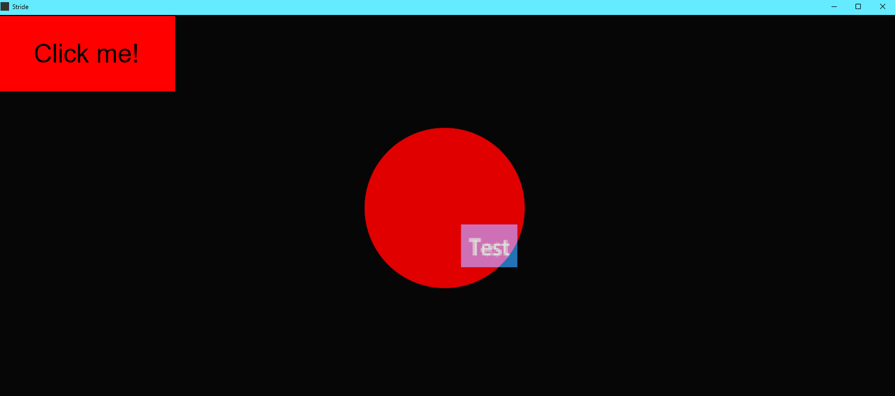

# General Information

With this setup it is possible to create a website (React-App) and use it wihtin vvvv as e.g. a (touch) interface.
The website and vvvv communicate through a websocket Server, which is runnning locally in vvvv.
The website sends JSON data to vvvv and vice versa.
In this case you get the touch gesture and movement/position as a string.

More infos in the code and vvvv patch :D

### :exclamation: This project uses additional packages, so you need [node.js](https://nodejs.org/en/download) and a package manager (npm comes with node.js)

# Start

Just open the vvvv patch and start the web-app. See further down on how to start the web-app. You should see a Stride Window like this:

The "Click me" Button is rendered in the web and sends a String to vvvv, which is then rendered as a skia graphics. 
The "Test" Button is rendered in vvvv (ImGui) and sends a String to the web-app, which results in a new html element rendering.
You can also touch/click anywhere on the screen, which changes the color of the red circle and by dragging/pinching, you can move/scale the circle. This circle is rendered in vvvv and the information comes from the web-app. In this case, there is no touhc/mouse input from vvvv side.

## How to start the Web Interface

In the project directory (/react-template), you can run:

### `npm install`

Installs all necessary packages. This web-app will not work without the packages!

### `npm start`

Runs the app in the development mode.\
Open [http://localhost:3000](http://localhost:3000) to view it in your browser.

The page will reload when you make changes.\
You may also see any lint errors in the console.

### `npm run build`

Builds the app for production to the `build` folder.\
It correctly bundles React in production mode and optimizes the build for the best performance.

Your app is ready to be deployed or served locally!

### `serve -s build`

Serves the build on a local server.

For more information:
[serve npm package documentation](https://www.npmjs.com/package/serve)

# Learn More about React

You can learn more in the [Create React App documentation](https://facebook.github.io/create-react-app/docs/getting-started).

To learn React, check out the [React documentation](https://reactjs.org/).

# Additional Information#

There is also a folder called "Web_Keyboard_for_react" which contains a styled keyboard Component, which you can import to your web-app and use as a virtual Keyboard.
